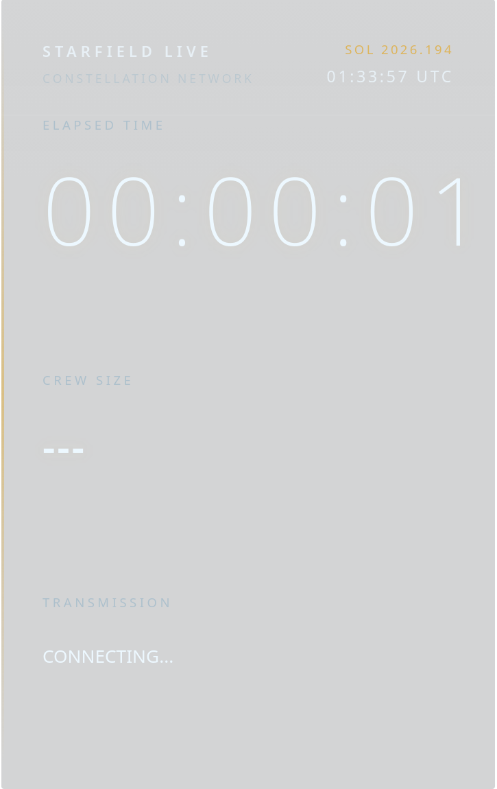

# OBS HUD

A modern and lightweight browser-source HUD for OBS Studio inspired by the clean science-fiction interface of **Starfield**.

Designed for livestreams, the overlay provides an elegant glass UI with a live session timer as well as a dynamically updating objective feed while remaining unobtrusive over gameplay.

---

## Features

* Minimal, distraction-free interface
* Lightweight React + Vite application
* Glassmorphism-inspired design
* Live session timer
* Smooth Motion animations
* Fully transparent browser source for OBS Studio
* Easy to customize and extend

---

## Preview


*A glimpse of the overlay, captured with a screenshot.*

---

## Getting Started

### Clone the repository

```bash
git clone https://github.com/mcckyle/OBS-HUD.git
cd OBS-HUD
```

### Install dependencies

```bash
npm install
```

### Start the development server

```bash
npm run dev
```

### Build for production

```bash
npm run build
```

---

## Using with OBS Studio

1. Build the project.
2. Add a **Browser Source** in OBS Studio.
3. Point the source to the generated application or your local development server.
4. Set the browser background to transparent.
5. Position the overlay wherever you prefer.

---


## Project Structure

```
OBS-HUD/
├── .github/              # GitHub workflows (CI/CD).
├── public/               # Static assets (served as-is).
├── src/                  # Application Source code.
│   ├── components/       # Reusable React components.
│   │   ├── HudHeader/
│   │   │   ├── HudHeader.jsx
│   │   │   └── HudHeader.css
│   │   │
│   │   ├── SessionTimer/
│   │   │   ├── SessionTimer.jsx
│   │   │   └── SessionTimer.css
│   │   │
│   │   ├── CrewPanel/
│   │   │   ├── CrewPanel.jsx
│   │   │   └── CrewPanel.css
│   │   │
│   │   ├── TransmissionPanel/
│   │   │   ├── TransmissionPanel.jsx
│   │   │   └── TransmissionPanel.css
│   │   │
│   │   └── HudSection/
│   │       ├── HudSection.jsx
│   │       └── HudSection.css
│   │
│   ├── utils/
│   │   └── time.js
│   │
│   │
│   ├── hooks/            # Custom React hooks.
│   │   ├── useYouTubeData.jsx
│   │   ├── useMissionClock.js
│   │   └── useSessionTimer.js
│   │
│   ├── App.jsx           # Main React application component.
│   ├── main.jsx          # React DOM entry point.
│   ├── App.css           # Styles specific to App.jsx.
│   └── index.css         # Global styles.
│
├── .gitignore            # Specifies intentionally untracked files and folders to ignore.
├── LICENSE               # Open source license for the project.
├── README.md             # Project overview / documentation.
├── eslint.config.js      # ESLint configuration.
├── index.html            # HTML entry point.
├── vite.config.js        # Vite config for build and development.
├── package.json          # Project metadata, dependencies, and scripts.
└── package-lock.json     # Exact versions of installed dependencies.
```

---

## Customization

The HUD is intentionally easy to customize.

You can easily modify:

* Colors
* Typography
* Panel layout
* Icons
* Animation timing
* Polling interval

---

## Built With

* React
* Vite
* Motion

---

## License

This project is licensed under the MIT License.

---

Created with ❤️ for immersive livestreams.
