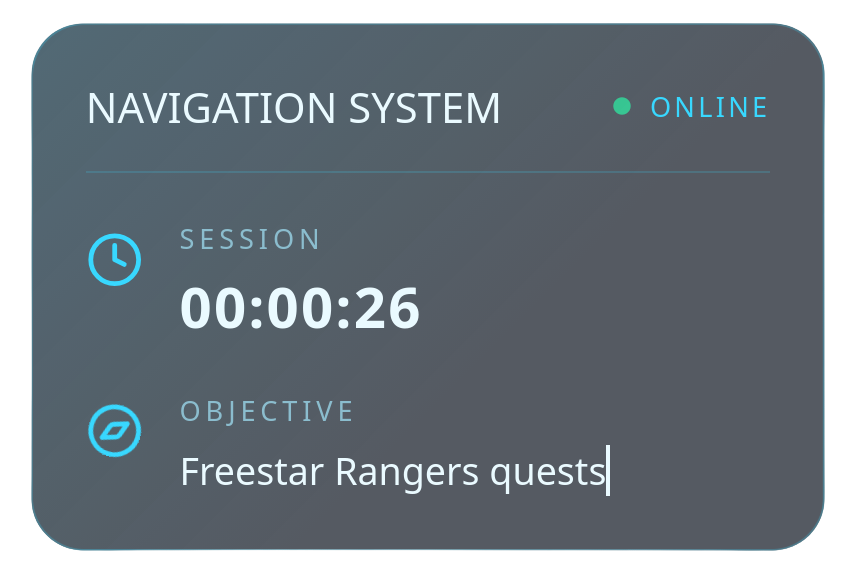

# OBS HUD

A simple, modern, and lightweight browser-source HUD for OBS Studio inspired by the clean science-fiction interface of **Starfield**.

Designed for livestreams, the overlay provides an elegant glass UI with a live session timer as well as a dynamically updating objective feed while remaining unobtrusive over gameplay.

---

## Features

* Minimal, distraction-free interface
* Lightweight React + Vite application
* Glassmorphism-inspired design
* Live session timer
* Dynamic objective updates via `mission.json`
* Smooth Motion animations
* Fully transparent browser source for OBS Studio
* Easy to customize and extend

---

## Preview


*A glimpse of the overlay, captured with a screenshot.*

---

## Getting Started

### Clone the repository

```bash
git clone https://github.com/mcckyle/OBS-HUD.git
cd OBS-HUD
```

### Install dependencies

```bash
npm install
```

### Start the development server

```bash
npm run dev
```

### Build for production

```bash
npm run build
```

---

## Mission Feed

The overlay polls `public/mission.json` every few seconds.

Example:

```json
{
  "objective": "Explore New Atlantis"
}
```

Updating the JSON automatically updates the objective displayed in OBS.

---

## Using with OBS Studio

1. Build the project.
2. Add a **Browser Source** in OBS Studio.
3. Point the source to the generated application or your local development server.
4. Set the browser background to transparent.
5. Position the overlay wherever you prefer.

---

## Project Structure

```
src/
├── App.jsx
├── App.css
├── index.css
└── main.jsx

public/
└── mission.json
```

---

## Customization

The HUD is intentionally easy to customize.

You can easily modify:

* Colors
* Typography
* Panel layout
* Icons
* Animation timing
* Polling interval
* Mission feed

---

## Built With

* React
* Vite
* Motion
* Lucide Icons

---

## License

This project is licensed under the MIT License.

---

Created with ❤️ for immersive livestreams.
