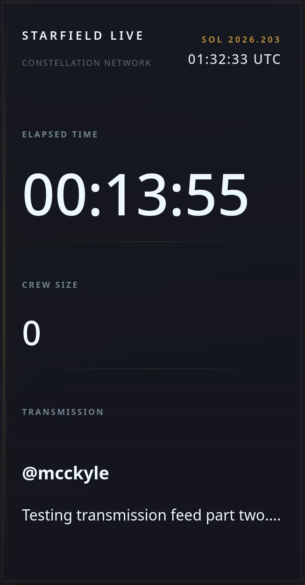

# OBS-HUD

A lightweight, NASA-punk inspired browser-source overlay for OBS Studio, designed for immersive **Starfield** livestreams.

OBS-HUD presents live stream telemetry in a clean, unobtrusive interface that complements gameplay instead of competing with it. Built with React and Vite, it delivers transparent rendering and live YouTube integration while remaining fast and easy to customize.

---

## Preview


*A minimal telemetry overlay designed to blend naturally with Starfield's visual language.*

---

## Features

* NASA-punk inspired interface
* Transparent browser source for OBS studio
* Live session timer
* Live YouTube subscriber count
* Recent YouTube comment feed
* Smooth Motion-powered animations
* Lightweight React architecture
* Easily customizable styling and layout

---

## Getting Started

### Clone the repository

```bash
git clone https://github.com/mcckyle/OBS-HUD.git
cd OBS-HUD
```

### Install dependencies

```bash
npm install
```

### Start the development server

```bash
npm run dev
```

### Build for production

```bash
npm run build
```

---

## OBS Studio Setup

1. Build the project or run the local development server.
2. Create a **Browser Source** in OBS Studio.
3. Point the Browser Source to the built application or development URL.
4. Enable a transparent background.
5. Position the overlay wherever you'd like within your scene.

---

## YouTube Configuration

The overlay reads its YouTube credentials directly from the Browser Source URL.

Example:

```bash
http://localhost:5173/OBS-HUD/?channelId=YOUR_CHANNEL_ID&key=YOUR_API_KEY
```

This approach keeps configuration separate from the source code and avoids embedding credentials directly in the project.

---


## Project Structure

```
OBS-HUD/
├── .github/              # GitHub workflows (CI/CD).
├── public/               # Static assets (served as-is).
├── src/                  # Application Source code.
│   ├── components/       # Reusable React components.
│   │   ├── HudHeader/
│   │   │   ├── HudHeader.jsx
│   │   │   └── HudHeader.css
│   │   │
│   │   ├── SessionTimer/
│   │   │   ├── SessionTimer.jsx
│   │   │   └── SessionTimer.css
│   │   │
│   │   ├── CrewPanel/
│   │   │   ├── CrewPanel.jsx
│   │   │   └── CrewPanel.css
│   │   │
│   │   ├── TransmissionPanel/
│   │   │   ├── TransmissionPanel.jsx
│   │   │   └── TransmissionPanel.css
│   │   │
│   │   └── HudSection/
│   │       ├── HudSection.jsx
│   │       └── HudSection.css
│   │
│   ├── utils/
│   │   └── time.js
│   │
│   ├── hooks/            # Custom React hooks.
│   │   ├── useYouTubeData.jsx
│   │   ├── useInterval.js
│   │   ├── useMissionClock.js
│   │   └── useSessionTimer.js
│   │
│   ├── App.jsx           # Main React application component.
│   ├── App.css           # Styles specific to App.jsx.
│   ├── main.jsx          # React DOM entry point.
│   └── index.css         # Global styles.
│
├── .gitignore            # Specifies intentionally untracked files and folders to ignore.
├── LICENSE               # Open source license for the project.
├── README.md             # Project overview / documentation.
├── eslint.config.js      # ESLint configuration.
├── index.html            # HTML entry point.
├── vite.config.js        # Vite config for build and development.
├── package.json          # Project metadata, dependencies, and scripts.
└── package-lock.json     # Exact versions of installed dependencies.
```

---

## Customization

OBS-HUD is intentionally modular. Common customizations include:

* Colors
* Typography
* Layout
* Animation timing
* YouTube polling interval
* HUD modules

---

## Built With

* React
* Vite
* Motion

---

## License

This project is licensed under the MIT License.

---

Created with ❤️ for immersive livestreams.
